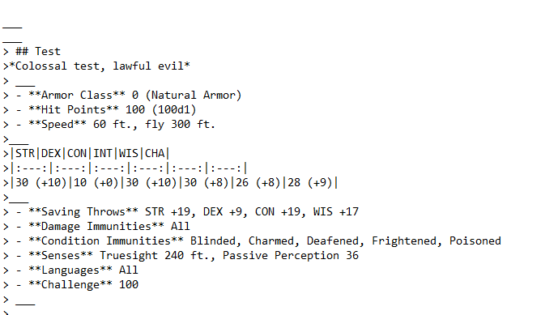
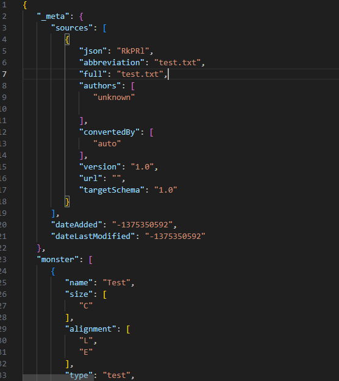
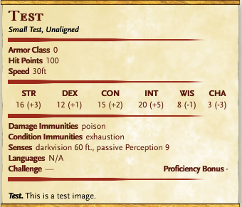
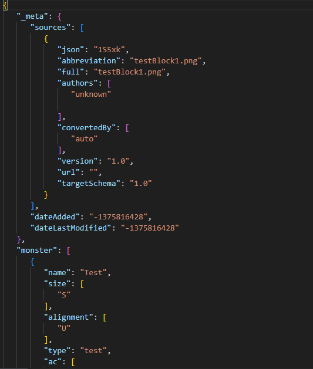
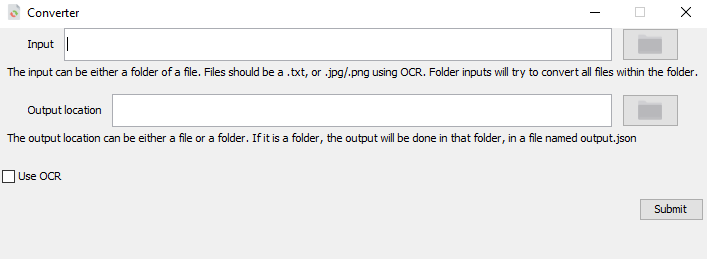

# Introduction
This app can convert homebrewery .txt files, as well as images of statblocks, into JSON usable by automated tools.

Before                     |  After
:-------------------------:|:-------------------------:
  |  
  |  

# Usage
## Requirements
This project requires [Java](https://www.oracle.com/ca-en/java/technologies/downloads/), [Python & PIP](https://www.python.org/), and [TesseractOCR](https://github.com/tesseract-ocr/tessdoc). \
I used the [UB Mannheim Tesseract Fork](https://github.com/UB-Mannheim/tesseract/wiki). \
TesseractOCR, Java, Python and PIP must be added to your computers PATH variable for them to be accessible by the OCR python scripts.
### Adding to PATH
For windows 10 & 11 users see [this](https://www.architectryan.com/2018/03/17/add-to-the-path-on-windows-10/). You should add the tesseract folder itself. 
The variable should look something like
> C:\Program Files\Tesseract-OCR

Do the same with java and python, as needed. \
It is recommended to reboot the system after doing this. 

## Building
This repository contains a maven wrapper. To compile the script, invoke the wrapper and call compile:
\
On windows, the command is:
> ./mvnw.cmd compile

With this done, you can run the application by simply running the Main file. The path of this file will look something like:
> target/classes/org/example/Main.class

## Running
The resulting GUI will look something like this. \
 \
Enter or select and input file/folder. Note that only OCR currently supports folders.
Then enter or select a file as the output path. Selected files will be overwritten. 
If you would like to convert images, click use ocr. \
When all this is done, click submit, and you will receive a popup when everything is done.\
OCR may take a few seconds, and even more on the first time, as the app downloads needed dependencies. 

# Issues
Please report any issues you encounter by raising a github issue.

TODO:
 - Create 'Accurate OCR' (use several ocr models, and combine output)
 - Change title and icon
 - add tests
 - Use static where it should be used
 - add ability to handle several .txt at the same time
 - add updating of module is given an existing json target as output
 - handle errors in OCR
- add support for modern homebrewery stayblocks
- Handle objects

Assets taken from [Iconpacks.net](https://www.iconpacks.net/)